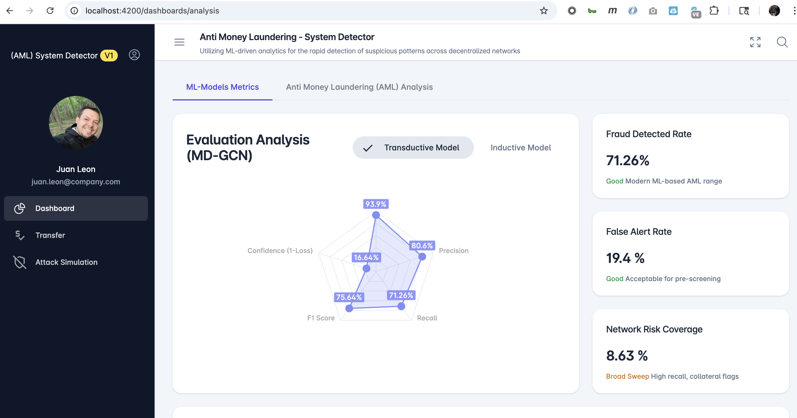

  
  
 

  <h1>Anti Money Laundering (AML) Anomaly detection system</h1>
  <h4>Template: CM3015 Machine Learning and Neural Networks</h4>
  <h4>University of London Computer Science CM3070 Final Project</h4>
  

  
  
 

  
<!-- Badges -->

  
  
  
  
  
  

   
<h4>
    <a href="https://github.com/ricleongo/CM3070_FinalProject/">View Demo</a>
   · 
    <a href="https://github.com/ricleongo/CM3070_FinalProject">Documentation</a>
   · 
    <a href="https://github.com/ricleongo/CM3070_FinalProject/issues/">Report Bug</a>
   · 
    <a href="https://github.com/ricleongo/CM3070_FinalProject/issues/">Request Feature</a>
  </h4>

 

<!-- Table of Contents -->
# Table of Contents

- [Table of Contents](#table-of-contents)
  - [About the Project](#about-the-project)
    - [Screenshots](#screenshots)
    - [Tech Stack](#tech-stack)
  - [Data Analytics](#data-analytics)
  - [Contributing](#contributing)
    - [Code of Conduct](#code-of-conduct)
  - [FAQ](#faq)
  - [License](#license)
  - [Contact](#contact)
  

<!-- About the Project -->
## About the Project
  

My project combines the security of Blockchain with advanced Machine Learning (MD-GCN) to make decentralized networks safer. While blockchain is famous for being unchangeable, it can still have weak points. By using 'Graph' technology, my tool can map out complex connections and use pre-trained logic to spot suspicious transactions or nodes based on past patterns of fraud and anomalies. 
  

<!-- Screenshots -->
### Screenshots

 
  

<!-- TechStack -->
### Tech Stack

  
Client

  <ul>
    <li><a href="https://angular.dev">Angular v19</a></li>
    <li><a href="https://www.typescriptlang.org/">Typescript</a></li>
    <li><a href="https://tailwindcss.com/">TailwindCSS</a></li>
    <li><a href="https://angular-material.fusetheme.com/auth/sign-in">FUSE Template</a></li>
  </ul>

  
Server

  <ul>
    <li><a href="https://fastapi.tiangolo.com">Python FastAPI</a></li>
    <li><a href="https://docs.pydantic.dev/latest">Pydantic Validation</a></li>
    <li><a href="https://www.tensorflow.org">Tensorflow</a></li>
    <li><a href="https://keras.io">Keras</a></li>
    <li><a href="https://docs.pytest.org/en/stable/">Pytest</a></li>
    <li><a href="https://pandas.pydata.org">Pandas</a></li>    
    <li><a href="https://scikit-learn.org/stable/">Scikit Learn</a></li>
    <li><a href="https://networkx.org/en/">NetworkX</a></li>
  </ul>

Database

  <ul>
    <li><a href="https://www.kaggle.com/datasets/ellipticco/elliptic-data-set">Elliptic Dataset</a></li>
    <li><a href="https://registry.opendata.aws/aws-public-blockchain/">AWS Public Blockchain Data</a></li>
    <li><a href="https://www.mongodb.com/">MongoDB</a></li>
  </ul>

<!-- Data Analytics -->
## Data Analytics

Prior to this project, I developed two MD-GCN models: an inductive model to classify new transactions and a transductive model for validation and identifying continuous connections. You can view this part of the analysis via this link: [Jupyter Notebook Data Analysis](https://github.com/ricleongo/CM3070_FinalProject/blob/main/analysis/Multi_Distance_Analysis.ipynb)

<!-- Contributing -->
## Contributing

Contributions are always welcome!

See `contributing.md` for ways to get started.

<!-- Code of Conduct -->
### Code of Conduct

Please read the [Code of Conduct](https://github.com/ricleongo/CM3070_FinalProject/blob/master/CODE_OF_CONDUCT.md)

<!-- FAQ -->
## FAQ

- How do I install and run backend?

  + Read documentation for [Running Locally Backend](https://github.com/ricleongo/CM3070_FinalProject/blob/main/back_end/README.md)

- How do I install and run frontend?

  +  Read documentation for [Running Locally Frontend](https://github.com/ricleongo/CM3070_FinalProject/blob/main/front_end/README.md)

<!-- License -->
## License

Distributed under the no License.

<!-- Contact -->
## Contact

Project Link: [https://github.com/ricleongo/CM3070_FinalProject](https://github.com/ricleongo/CM3070_FinalProject)

