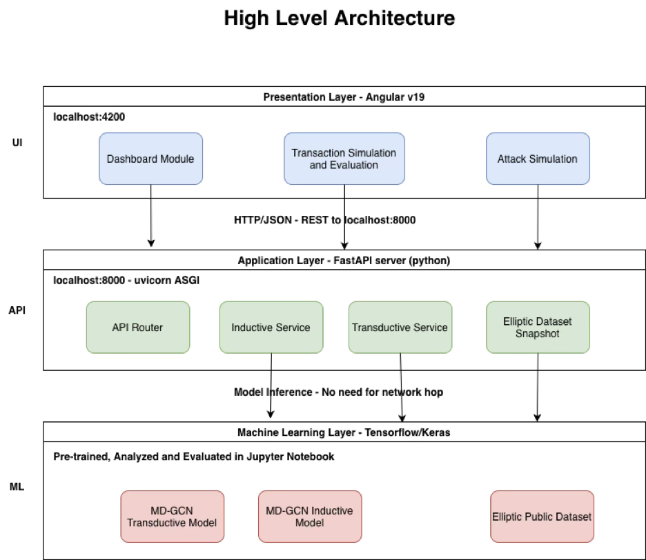
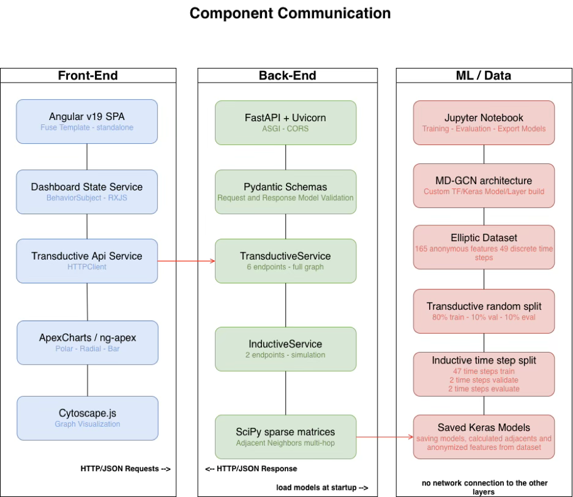
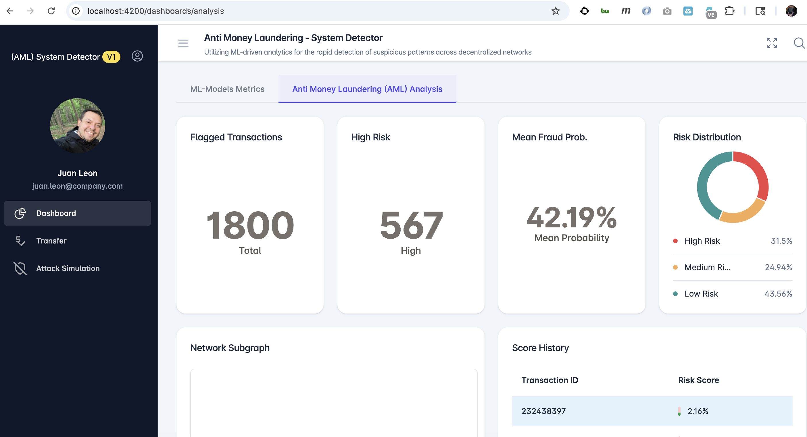
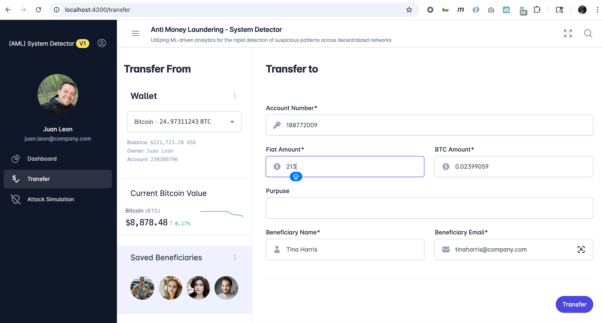

  
  
 

  <h1>Machine Learning Techniques for Blockchain Anomaly Detection</h1>
  <h4>Template: CM3015 - Machine Learning and Neural Networks Template</h4>
  <h4>University of London Computer Science CM3070 Final Project</h4>
  <h4>UoL Student Id: 190128155</h4>
  

  
  
 

  
<!-- Badges -->

  
  
  
  
  
  

   
<h4>
    <a href="https://github.com/ricleongo/CM3070_FinalProject/">View Demo</a>
   · 
    <a href="https://github.com/ricleongo/CM3070_FinalProject">Documentation</a>
   · 
    <a href="https://github.com/ricleongo/CM3070_FinalProject/issues/">Report Bug</a>
   · 
    <a href="https://github.com/ricleongo/CM3070_FinalProject/issues/">Request Feature</a>
  </h4>

 

<!-- Table of Contents -->
# Table of Contents

- [Table of Contents](#table-of-contents)
  - [About the Project](#about-the-project)
  - [Design Architecture](#design-architecture)
    - [MD-GCN Architecture](#md-gcn-architecture)
    - [MD-GCN Architecture and Mathematical Foundation](#md-gcn-architecture-and-mathematical-foundation)
      - [Core Mathematical Formulation](#core-mathematical-formulation)
  - [Data Analytics](#data-analytics)
  - [Screenshots](#screenshots)
  - [Tech Stack](#tech-stack)
  - [Contributing](#contributing)
    - [Code of Conduct](#code-of-conduct)
  - [FAQ](#faq)
  - [License](#license)
  - [Contact](#contact)
  - [References](#references)
  

<!-- About the Project -->
## About the Project

Blockchain technology has emerged as a foundational infrastructure for decentralized systems due to its core properties of immutability, transparency, decentralization, and cryptographic security. These characteristics make blockchain particularly attractive for financial transactions, digital asset transfers, and smart contract execution. However, the same properties that strengthen blockchain systems also introduce significant challenges for security and fraud prevention. The pseudonymous nature of blockchain addresses, the high throughput of transactions, and the increasing sophistication of malicious actors make traditional rule-based or static security mechanisms insufficient for detecting fraudulent or anomalous behaviors in real time.

The integration of ML with blockchain creates a synergistic architecture in which blockchain ensures data integrity, audit-ability, and trust, while ML delivers predictive intelligence and adaptability. In this paradigm, blockchain acts as a secure and tamper-resistant data layer, whereas ML operates as an intelligent analytical layer capable of real-time inference. Smart contracts further enhance this integration by enabling automated responses (such as transaction flagging, blocking, or escalation) when suspicious patterns are detected. Consequently, ML-enhanced blockchain systems are increasingly viewed as a necessary evolution for combating fraud, anomaly propagation, and systemic vulnerabilities in decentralized environments.

<!-- Design Architecture -->
## Design Architecture

The proposed system is structured around three distinct architectural layers that interact cohesively to fulfill the complete process workflow. Each layer encapsulates a well-defined set of responsibilities, thereby adhering to the principle of separation of concerns commonly adopted in enterprise-grade software design

The <strong>Presentation Layer (UI) </strong>constitutes the user-facing interface through which end-users interact directly with the application. This layer is responsible for rendering dynamic visual components, including performance dashboards and simulation interfaces, and for transmitting user-initiated requests to the underlying application logic. To ensure cross-platform compatibility and an inclusive user experience, the Presentation Layer was implemented using Fuse, a commercially licensed Angular v19 administration template (Bategornym, n.d.) that provides a comprehensive suite of pre-built UI components and responsive layout primitives.

The <strong>Application Layer (API)</strong> serves as the intermediary tier responsible for orchestrating the core business logic of the system. It establishes the communication bridge between the Presentation Layer and the Machine Learning Models by exposing a set of well-defined RESTful API endpoints. These endpoints are carefully designed to address the functional requirements of each identified use case, ensuring a clean separation between data processing and data presentation. This layer is implemented using FastAPI, a high-performance Python web framework that facilitates asynchronous request handling and automatic OpenAPI specification generation.

The <strong>Machine Learning Layer (ML)</strong> functions as the analytical and evaluative backbone of the platform. Within this layer, raw transaction data undergoes a structured pipeline of preprocessing, feature extraction, model training, cross-validation, and performance evaluation. The primary objective of this layer is to identify anomalous behavioral patterns within the blockchain ecosystem, particularly those consistent with illicit financial activity such as money laundering.

  

<!-- MD-GCN Architecture -->
### MD-GCN Architecture

The Multi-Distance Graph Convolutional Network (MD-GCN) constitutes the machine learning architecture employed for the training and evaluation of both the Transductive and Inductive models. This architecture was selected on the basis of its inherent compatibility with graph-structured data, which mirrors the native topology of the Bitcoin blockchain (a distributed ledger in which transactions are naturally represented as directed graphs).

Unlike conventional convolutional neural networks that operate on Euclidean data (images or sequences), GCN-based architectures aggregate feature information not only in the direct neighbors but also across multi-hop neighborhood structures, enabling the model to capture relational dependencies between non-adjacent nodes. The 'multi-distance' extension further enhances this capability by incorporating neighborhood information at varying topological distances, thereby improving the model's sensitivity to indirect transaction relationships that are characteristic of layered money laundering schemes.

  

<!-- MD-GCN Architecture and Mathematical Foundation -->
### MD-GCN Architecture and Mathematical Foundation

he MD-GCN is an extension of the classical Graph Convolutional Network that addresses one of its most significant limitations: the restriction of neighborhood aggregation to directly adjacent nodes only. In the standard GCN formulation, each node aggregates feature information exclusively from its first-order neighbors, meaning that structural relationships beyond a single hop are entirely invisible to the model. This constraint is particularly problematic in the context of money laundering detection, where illicit activity is often distributed across multi-step transaction chains rather than concentrated at a single node.

Conceptually, the MD-GCN operates on a principle analogous to that of a standard Convolutional Neural Network (CNN). Whereas a CNN applies learned filters across a spatial grid of pixels to extract hierarchical image features, the MD-GCN applies learned transformations across a graph structure (a connected network of nodes and edges) aggregating information at progressively greater topological distances. Each additional hop distance effectively expands the receptive field of the convolution, allowing the model to detect patterns that span multiple transaction layers.

#### Core Mathematical Formulation

The aggregation operation performed by the MD-GCN at each layer is expressed by the following formula:

$$
\mathbf{H}^{(l)} = \sigma \left( \sum_{k=1}^{K} \tilde{\mathbf{A}}_k \mathbf{H}^{(l-1)} \mathbf{W}_k^{(l)} \right)
$$

Where each term is defined as:
<li>
Â⁽ᵏ⁾: It is the symmetrically normalized adjacency matrix at hop distance k, computed as , where D is the diagonal degree matrix
</li>

<li>
H⁽ˡ⁾: It is the matrix of node feature representations at layer `l`
</li>

<li>
σ: It is a non-linear activation function; ReLU is applied in this implementation
</li>

<li>
W⁽ˡ⁾: It is the matrix of learnable weight parameters at layer `l`
</li>

The summation over all hop distances k from 0 to K is what distinguishes the MD-GCN from its classical counterpart: rather than performing a single aggregation over direct neighbors, the model accumulates transformed representations from each distance level independently before applying the non-linearity. This allows the network to simultaneously reason about local node structure and longer-range relational patterns within the same forward pass.

&nbsp;

<!-- Data Analytics -->
## Data Analytics

Prior to initiating the model training process, a series of preprocessing steps were performed to transform the raw Elliptic Public Dataset into a graph-compatible input structure suitable for consumption by the MD-GCN architecture. This preparation phase encompassed three principal tasks: feature and label separation, graph topology construction, and adjacency matrix computation.

You can view this part of the analysis via this link: [Jupyter Notebook Data Analysis](https://github.com/ricleongo/CM3070_FinalProject/blob/main/analysis/Multi_Distance_Analysis.ipynb)

&nbsp;

<!-- Screenshots -->
## Screenshots

 
  

 
  

 
  

<!-- TechStack -->
## Tech Stack

  
Client

  <ul>
    <li><a href="https://angular.dev">Angular v19</a></li>
    <li><a href="https://www.typescriptlang.org/">Typescript</a></li>
    <li><a href="https://tailwindcss.com/">TailwindCSS</a></li>
    <li><a href="https://angular-material.fusetheme.com/auth/sign-in">FUSE Template</a></li>
  </ul>

  
Server

  <ul>
    <li><a href="https://fastapi.tiangolo.com">Python FastAPI</a></li>
    <li><a href="https://docs.pydantic.dev/latest">Pydantic Validation</a></li>
    <li><a href="https://www.tensorflow.org">Tensorflow</a></li>
    <li><a href="https://keras.io">Keras</a></li>
    <li><a href="https://docs.pytest.org/en/stable/">Pytest</a></li>
    <li><a href="https://pandas.pydata.org">Pandas</a></li>    
    <li><a href="https://scikit-learn.org/stable/">Scikit Learn</a></li>
    <li><a href="https://networkx.org/en/">NetworkX</a></li>
  </ul>

Database

  <ul>
    <li><a href="https://www.kaggle.com/datasets/ellipticco/elliptic-data-set">Elliptic Dataset</a></li>
    <li><a href="https://registry.opendata.aws/aws-public-blockchain/">AWS Public Blockchain Data</a></li>
    <li><a href="https://www.mongodb.com/">MongoDB</a></li>
  </ul>

<!-- Contributing -->
## Contributing

Contributions are always welcome!

See [**contributing.md**](https://github.com/ricleongo/CM3070_FinalProject/blob/master/CONTRIBUTING.md) for ways to get started.

<!-- Code of Conduct -->
### Code of Conduct

Please read the [Code of Conduct](https://github.com/ricleongo/CM3070_FinalProject/blob/master/CODE_OF_CONDUCT.md)

<!-- FAQ -->
## FAQ

- How do I install and run backend?

  + Read documentation for [Running Locally Backend](https://github.com/ricleongo/CM3070_FinalProject/blob/main/back_end/README.md)

- How do I install and run frontend?

  +  Read documentation for [Running Locally Frontend](https://github.com/ricleongo/CM3070_FinalProject/blob/main/front_end/README.md)

<!-- License -->
## License

Distributed under the no License.

<!-- Contact -->
## Contact
LinkedIn: [https://www.linkedin.com/in/ricleongo/](https://www.linkedin.com/in/ricleongo/)

Project Link: [https://github.com/ricleongo/CM3070_FinalProject](https://github.com/ricleongo/CM3070_FinalProject)

<!-- References -->
## References

* Chawla, N. V., et al. (2002). **SMOTE: Synthetic minority over-sampling technique.** *Journal of Artificial Intelligence Research*, 16, 321–357.
* Dal Pozzolo, A., et al. (2015). **Adaptive machine learning for credit card fraud detection.** *Expert Systems with Applications*, 41(4), 1–11.
* Chen, X., et al. (2025). **Multi-distance spatial–temporal graph neural network for anomaly detection.** *Advanced Intelligent Systems*.
* Kipf, T. N., & Welling, M. (2017). **Semi-supervised classification with graph convolutional networks.** *ICLR*.
* Pranto, T. H., et al. (2022). **Blockchain and machine learning for fraud detection.**
* Weber, M., et al. (2019). **Anti-Money Laundering in Bitcoin: Experimenting with Graph Convolutional Networks for Financial Forensics**
* Fuse Angular admin template. [Fuse Angular admin template](https://themeforest.net/item/fuse-angularjs-material-design-admin-template). *ThemeForest*.
* Kaggle Elliptic Dataset [Elliptic Data Set - EDA, Graphs, Random Forest](https://www.kaggle.com/discussions/general/32747).
